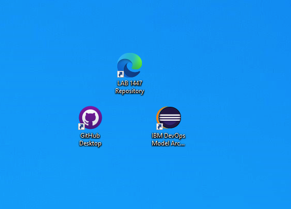

# Lab 0

## Cloning the GitHub Repository

### Logging into Lab environment

1. Click on the empty screen to get the login dialog
   1. 
   2. 
2. Enter the password "IBMDem0s" in the password field and press enter
   1. 
3. You are now logged in into your lab environment

### Prepare to clone the repository

1. Doubleclick on the browser icon/url "LAB 1447 repository" to open a browser and view the repository
   1. 
   2. 
2. If you have an GitHub account you can login and fork this repository if you plan to add your changes
3. In this lab we will just clone the original repository without pushing changes.
4. Click on "Code" Button to get the clone dialog
   1. 
5. You can now either copy the URL to be used with GitHub Desktop or click on "Open with Github Desktop" when you have used it before.
   1. 

### Using Github Desktop

1. Doubleclick on the "GitHub Desktop" icon on the desktop and the startup screen appears
   1. 
   2. 
2. On this screen click on "skip this step" if you do not have a Github account, else login using the link "Sign in to GitHub.com"
3. If you used "skip .." a dialog asks you for a name and email adress
   1. You can either provide yours or use a dummy one like in the screenshot
   2. 
   3. Press Finish
4. In the next dialog step you will be asked if you want to clone an existing repository, create on or use a local one
   1. 
5. Click on "Clone a repository from internet" and in the next dialog step select the tab "URL"
   1. here paset the URL you have copied before and either select the default local folder or provide your own
   2. 
   3. Click on "Clone" to proceed
6. The repository will be copied to your local drive in a few seconds and information will be provided when it is finished if you want it to be opened in Visual Studio Code or show it with the File Explorer
   1. 
7. We will use the Explorer to open the new folder and have a look at its files.
    1. 

## Conclusion of Lab 0

You have now successfully cloned our Lab repository which contains the working files and the documentation.
