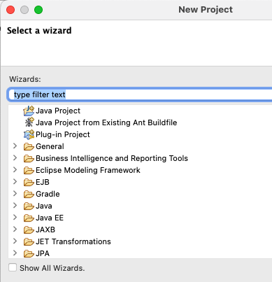

# Introduction

## Create a project

1. Click on Create a Project link
   1. 
2. In the wizard search and select the modeling project type
   1. 
   2. 
3. Provide a name for your new project.
   1. 
4. Select "General" from Categegories and "Blank Package" from Templates
   1. 
5. Have a look at your freshly created new Project
   1. 

## Basic UML Models and Basic UML Diagrams
