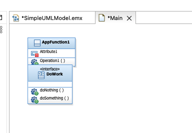

# Lab 1

## Basic usage and introduction to UML Models and Diagrams

What we want to achieve in this lab a short introduction how to use DevOps Model Architect. You will get an overview how to use the Modeling Perspective and a simple intro into UML Models and Diagrams.

### Start DevOps Model Architect and Switch to Modeling Perspective

1. Doubleclick on the icon for "IBM DevOps Model Architect" on the Desktop

   

2. Select a workspace folder for Eclipse. You can for example call it `dma_workspace_YOURNAME`.

   

3. The first time you open a new workspace you will get the Welcome Page. Close it by pressing the **Workbench** button in the upper right corner.

   

4. Next switch to the Modeling Perspective
   1. Click on the Menu "Window" on top of Eclipse

      

   2. Click on Open Perspective then on Other

      

   3. Dialog opens with list of perspectives

      

   4. Scroll down and Select "Modeling" from the list

      

   5. The Modeling Perspetive opens. You can also switch Perspectives using the icon on the top right corner

      

### Create a project

1. Click on Create a new Model Project or Create Project

   

   

2. In the case you selected "Create a Project" a wizard will be shown.
3. Search and select the modeling project type

   

   

4. Provide a name for your new project.

   

5. Select "General" from Categegories and "Blank Package" from Templates

   

6. Have a look at your freshly created new Project

   

### Basic UML Models and Basic UML Diagrams

1. If Project is collapsed, click on the > symbols to expand Project and Elements

   

   

   

2. Add new Class to Model by right clicking the Package and select the class entry in the UML menu

   

   

3. This creates a fresh new class. Name this new class "Customer"

   

   

4. Next add a new attribute to this class using the context menu of the element and name it "custID"

   

   

   

5. Now create an additional attribute and name it "custName"

   

6. Create a new Diagram to manage all customer related model artifacts and name it "CustomerStore_Class"

   

   

   

7. Add our "Customer" class to this diagram by using the context menu of the item

   

   

8. Don't forget to save all your changes!

### How to import existing artifacts

1. Right click Project to open context menu and select Import

   

2. In this lab we want to import from the filesystem, please select "file system" in the wizard dialog

   

   click on **Next**
3. In the file system dialog browse for the "Simple-Model" folder from your repository

   

   click on **Browse** and select "Simple-Model"

   

   click on **Open**
4. The Import dialog opens

   

5. Select the folder on the left (checkbox) and the model file will be automatically selected.

   

6. Click on **Finish** to start the import
7. The modeling artifact is imported and "SimpleUMLModel" is shown.

   

8. Double-click on the newly created Model and a migration dialog will open as the artifacts were created with older version.

   

   Just accept the default settings and the diagram will be opened

   

9. To have a better view, right click on the canvas to open context menu and select "Arrange All"

   

   

### How to add a new UML artifact to existing diagram

1. Adding new UML artifacts to a diagram can be done by using the "Palette" or the context menue of the diagram.
2. First we will use the "Palette"
   1. On the right side of DevOps Model Architect you will find the "Palette" menue.
   2. Click on "Class" entry to get all UML class types available

      

   3. Drag and drop the "Class" element from the Palette to the open diagram.
   4. A fresh new class is added and the name is selected for change. Change the name to "APPF2"

      

   5. Now we want to create a relationship from "APPF2" to "AppFunction1"
      1. click and drag the "incoming" icon to "AppFunction1"

      

      

   6. A new dialog opens and use "Create Instance" type

      

   7. The relation "create instance" is established between these two elements

      

   8. Do not forget to save your changes!

## Conclusion of Lab 1

In this Lab we have been introduced how to use DevOps Model Architect to create a project, work on simple diagrams and import existing artifacts.
