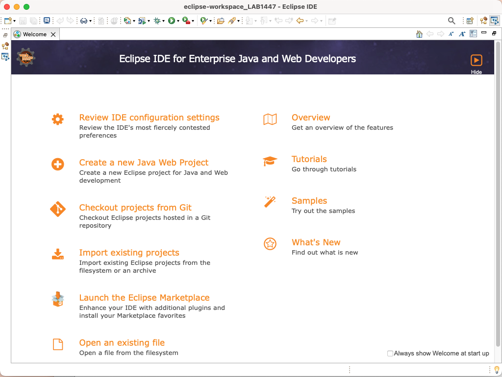
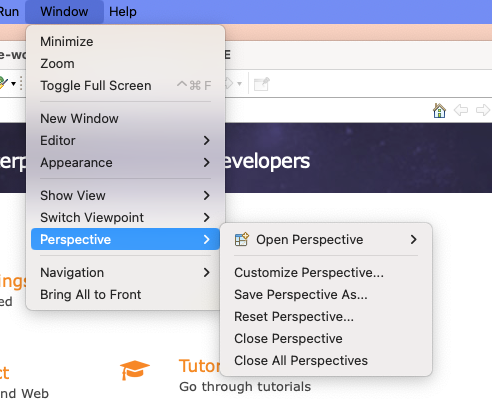

# Introduction

## Switch to Modeling Perspective

1. After a fresh installation of Eclipse you will get the Welcome Page
   1. 
2. Next switch to the Modeling Perspective
   1. Click on the Menu "Window" on top of Eclipse 
   2. 
   3. Click on Open Perspective then on Other
   4. 
   5. Dialog opens with list of perspectives
   6. 
   7. Scroll down and Select "Modeling" from the list
   8. 
   9. The Modeling Perspetive opens. You can also switch Perspectives using the icon on the top right corner
   10. 

## Create a project

1. Click on Create a Project link
   1. 
2. In the wizard search and select the modeling project type
   1. 
   2. 
3. Provide a name for your new project.
   1. 
4. Select "General" from Categegories and "Blank Package" from Templates
   1. 
5. Have a look at your freshly created new Project
   1. 

## Basic UML Models and Basic UML Diagrams
