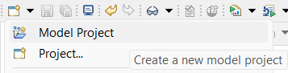
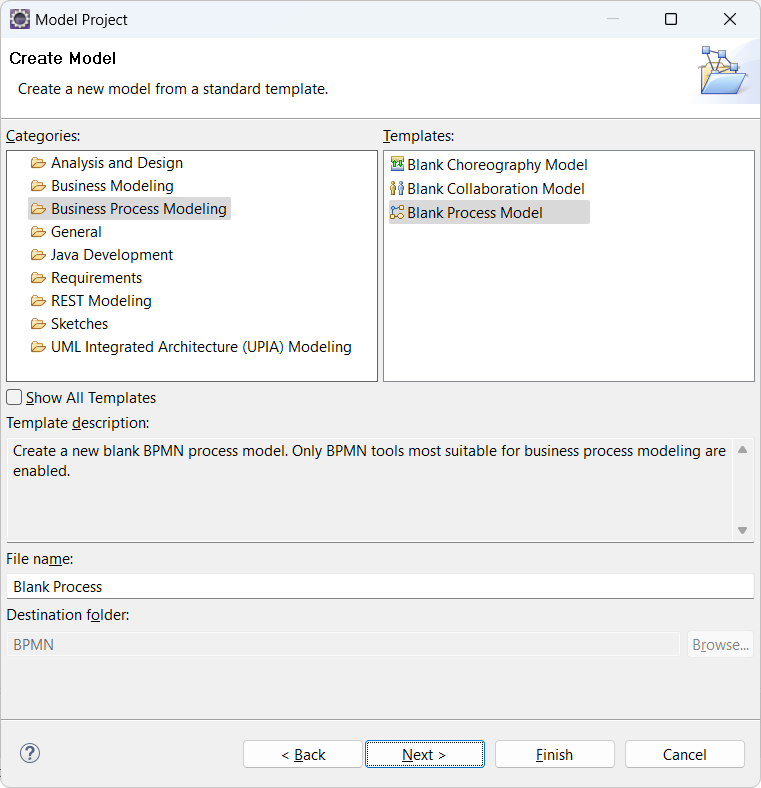
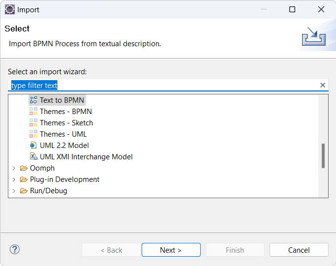
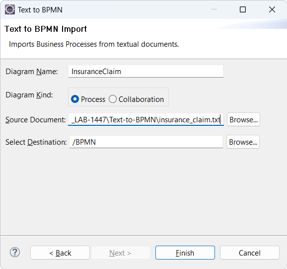
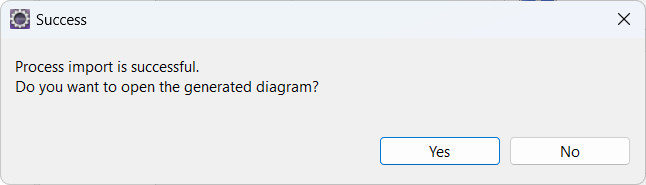

# Introduction

## Lab 2: BPMN Introduction

BPMN (Business Process Model and Notation) is a standard for describing business processes. In this lab you will use DMA to create a BPMN model and diagram by importing a textual description of a business process.
For this lab the required environment has been setup. If you want to try it in your own environment, please follow this [setup documentation](https://www.ibm.com/docs/en/dma?topic=diagrams-importing-textual-document-bpmn).

### Create a BPMN Project

1. Create a new model project

   

2. Give the new project the name **BPMN** and click **Next**

3. Select the **Blank Process Model** template and click **Finish**

   

### Import a Business Process from a Text File

1. In the **File** menu perform the command **Import...**. Select the **Text to BPMN** import wizard.

   

2. On the next wizard page fill out the fields as shown in the picture below. The source document to be imported can be found in the cloned Git repository at `DevOps-Model-Architect/TechXchange2024_LAB-1447/Text-to-BPMN/insurance_claim.txt`. Set the destination to the BPMN project that you created above.

   

3. Click **Finish** and wait for DMA to analyze the text file and translate it to a BPMN model and a diagram. It can take a while so be patient.

4. Click **Yes** to open the generated BPMN diagram.

   

5. Write your own business process in a text file and import it by following the steps above. You can use the same BPMN project as the destination.

## Conclusion of Lab 2

This lab has introduced you to BPMN and how DevOps Model Architect can create a BPMN model and diagram from a textually described business process. You can of course also create business processes in DMA by manual creation of the BPMN diagrams, or you can start by importing a text file and then continue to refine it manually.
