# Lab 3

## Modeling for OpenAPI

OpenAPI is a standard, programming language-agnostic interface description for HTTP APIs. In this lab you will use DMA to create a model representation of an OpenAPI YAML file, and visualize it in a class diagram.

### Create a Model Project for OpenAPI

1. Create a new model project

   

2. Give the new project the name **OpenAPI** and click **Next**

3. Select the **REST Service Model (OpenAPI3)** template and click **Finish**

   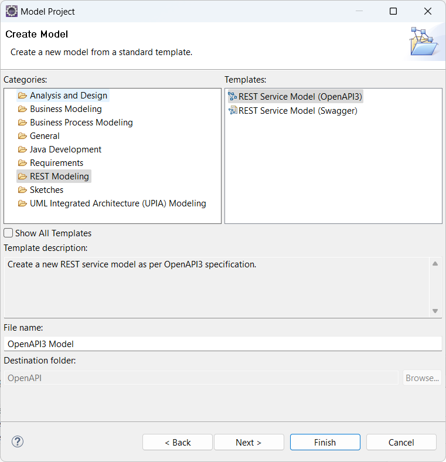

### Import an OpenAPI YAML file and create a model representation for it

1. The OpenAPI specification provides several sample APIs. We will import an API that describes a pet store. Download the YAML file for this API [from a web browser](https://github.com/OAI/OpenAPI-Specification/blob/main/examples/v3.0/petstore.yaml). Save it in a folder on the lab computer.

   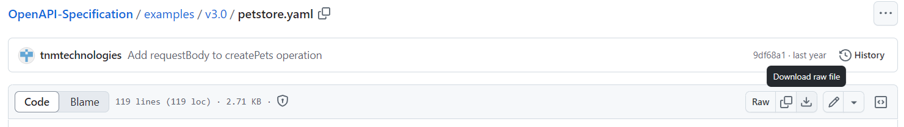

2. Import the YAML file into the OpenAPI project by dragging it from the folder where you saved it and dropping it onto the OpenAPI project. Select to copy the file into the project.

   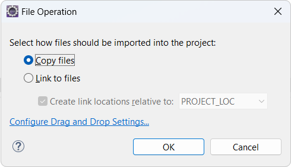

3. Select the OpenAPI model project and perform the command **File - New - Transformation Configuration**

   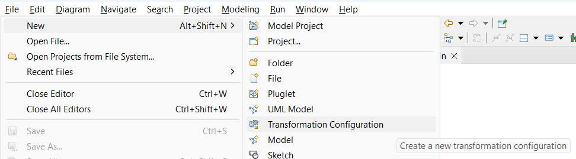

4. Give the transformation configuration a name ("PetStore) and select **OpenAPI 3.0 to REST Service Model** in the list. Then click **Finish**.  

   

5. The transformation configuration editor opens and shows there are errors. This is because we haven't yet specified the source and target for this transformation. Let's do it now. Click the **Source and Target** tab in the transformation configuration editor and set the YAML file as the source, and the OpenAPI3 Model as the target.

   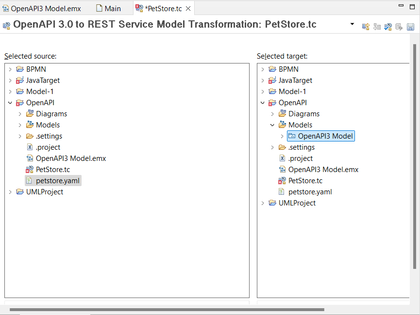

6. To make the errors go away click the button to **Validate the transformation configuration** in the transformation configuration editor toolbar.

   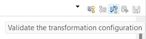

7. Finally, to run the transformation click the button **Run OpenAPI 3.0 to REST Service Model**.

   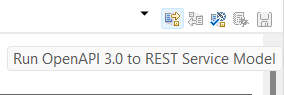

8. DMA will now transform the YAML file into a model and insert it into the target model. A Merge dialog will appear to inform about the model elements that will be merged into the model. Click **OK** to proceed.

9. The model representation of the Pet Store API is now available in the OpenAPI model.

   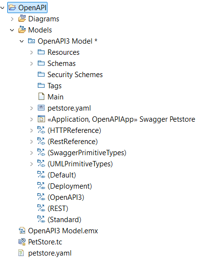

### Visualize the API model graphically

1. Create a class diagram from the context menu of the "Diagrams" virtual folder. In the dialog give it a name ("PetStoreAPI") and press **OK**.

   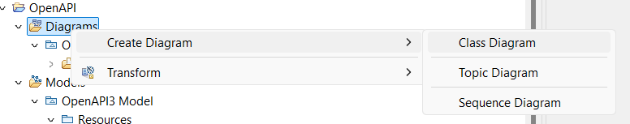

2. Select some of the model elements in the Project Explorer.

   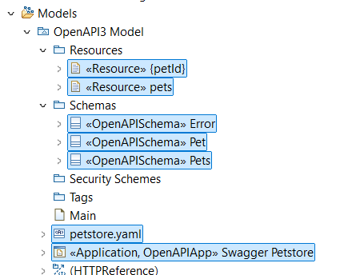

3. Drag them from the Project Explorer and drop them onto the class diagram.

   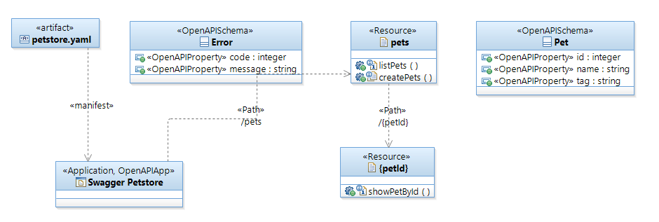

## Conclusion of Lab 3

This lab has introduced you to how OpenAPI models can be created in DMA. Here we started by importing an existing YAML file, but you can of course also start by creating the model from scratch. DMA also supports generating the OpenAPI YAML file from the model. The steps are very similar to those mentioned above. Feel free to try it! (Hint: The transformation configuration to use for this is called **REST Service Model to OpenAPI 3.0**).
