# Lab 4

## Modeling for Java Developers

In this lab we will look at some scenarios where DMA can help you when developing Java applications.

### Import Java Code from GitHub

1. Switch to the Git perspective and click the hyperlink in the **Git Repositories** view for cloning a Git repository. Select **GitHub** in the dialog.

   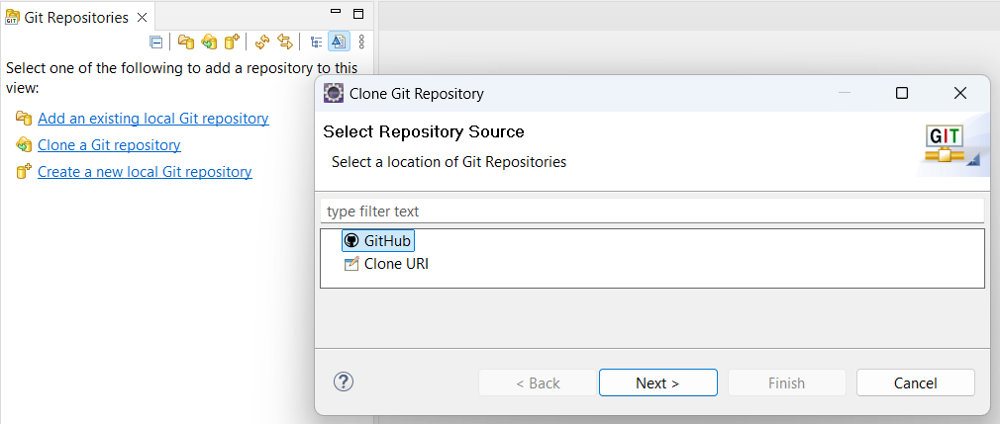

2. Search for a Java Git repository with the name **geojson-model-java**. Pick the found repository with that name.

   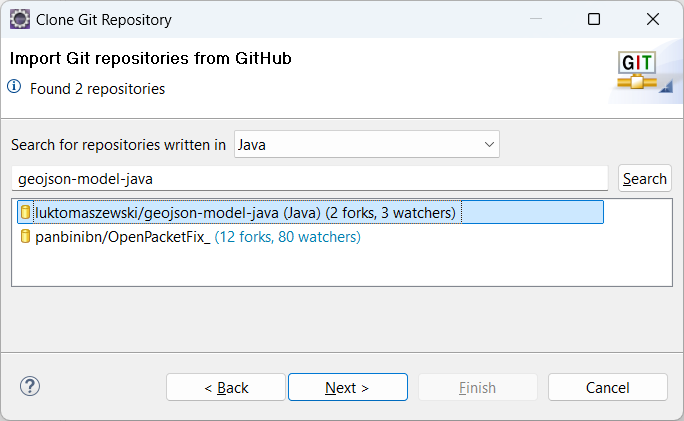

3. Click the **Next** button twice and then enter a local directory where to store the Git repository locally. Then click **Finish**.

   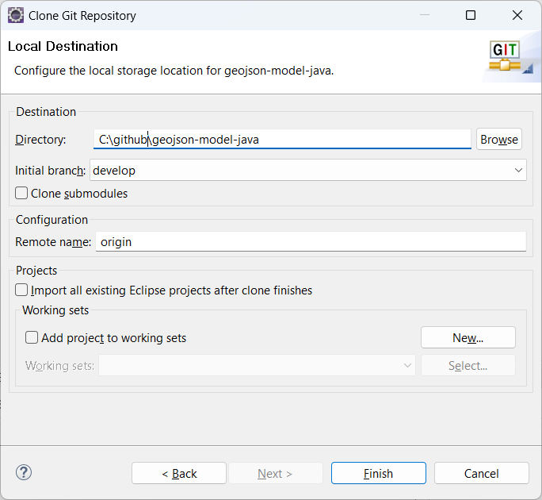

4. Right-click on the Git repository in the **Git Repositories** view and perform the command **Import projects**. Click **Finish** in the dialog that appears.

5. Now switch to the Modeling perspective. You should see the imported Java project in the Project Explorer:

   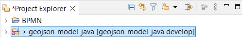

The purpose of this lab is not to build the Java code so don't worry about the Java build problems that are reported on the project.

### Visualize Java Code in Diagrams

1. Expand in the Project Explorer so you can select the Java files of the "geojson" package:

   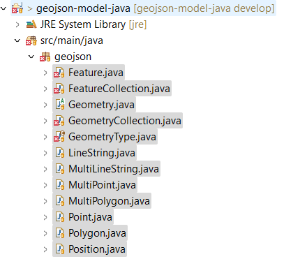

2. Right-click and perform the context menu command **Visualize - Add to New Diagram File - Class Diagram**. In the dialog choose to place the new class diagram at the root of the Java project. Click **Finish**.

   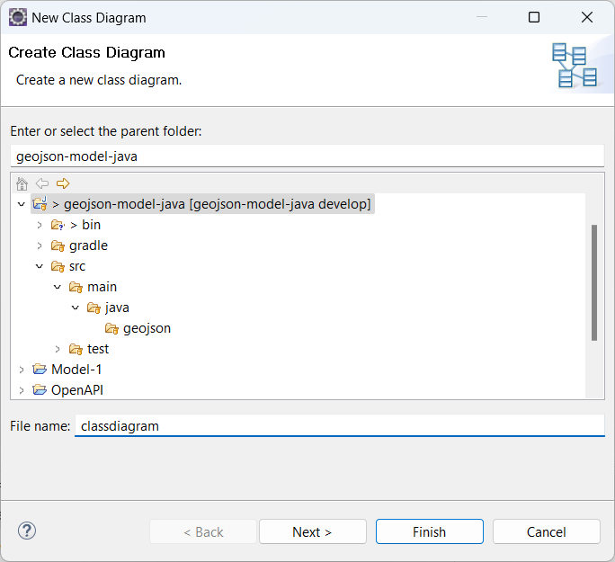

3. A class diagram appears where the contents of all selected Java files are shown.

   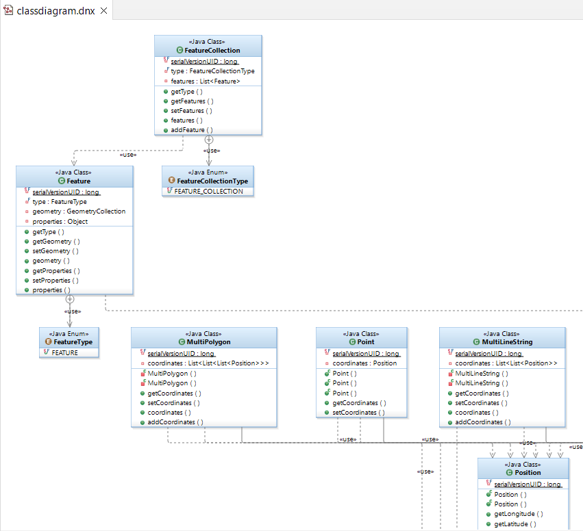

   Note that DMA has created this class diagram as a visualization of the Java code, without first creating a model for it. You can use the diagram as a means to navigate around in the Java code and even to edit it.

4. Double-click on symbols in the class diagram to navigate to the corresponding Java types. You can also double-click on attributes and methods to navigate to them.

5. Select the "getType()" method of the "FeatureCollection" class. Note how a popup appears showing the implementation of this method. Press **F2** to bring focus to the popup and then type a comment in the method. Then click the Save button to save the changes.

   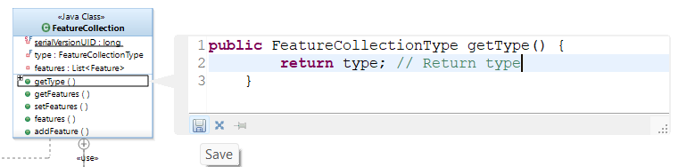

6. Double-click on the "getType()" method to confirm that your comment was added in the Java method:

   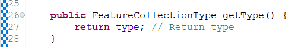

### Create a UML Model from the Java Code

1. Create a new model project (**File - New - Model Project**). In the dialog give it a name ("GeoJsonModel") and press **Next**. Select the **Java Development** category and the **Blank Model** template. Click **Finish**.

   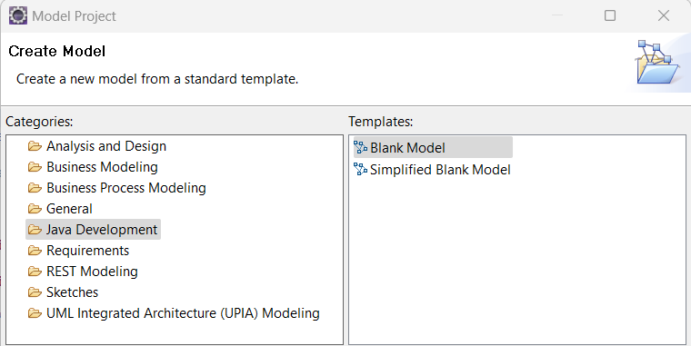

2. Right-click the created project and perform the context menu command **Transform - New Configuration**. Give the transformation configuration a name ("JavaToUML") and set the transformation kind to "Java to UML". Click **Finish**.

   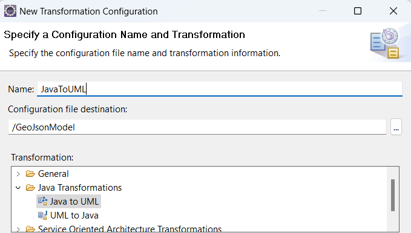

3. The transformation configuration editor opens. In the **Source and Target** tab set the source to be the "geojson" Java package and the target to be the package of the "GeoJsonModel" project.

   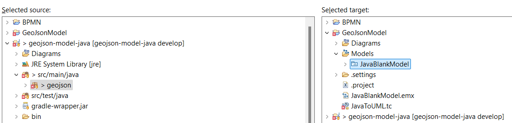

4. Save the transformation configuration and then run the transformation by clicking the button **Run Java to UML** in the transformation configuration editor toolbar:

   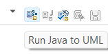

5. The Java code is transformed to a UML model. A dialog appears where you can preview what model elements that will be created. Click **OK** and then expand the "GeoJsonModel" project to see the model elements.

   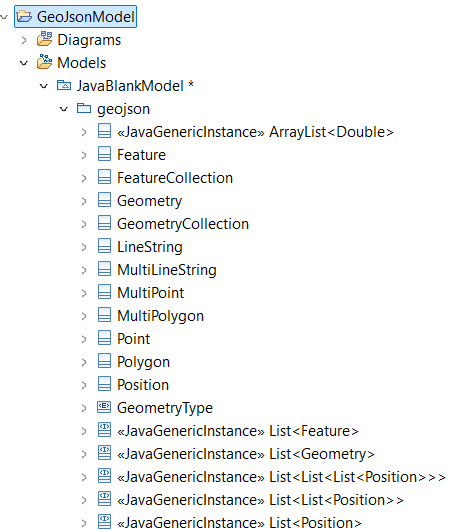

### Visualize and Edit the UML Model

1. Right-click on the "geojson" package and create a new class diagram (**Add Diagram - Class Diagram**).

2. Select some or all of the classes in the "geojson" package and drag-drop them onto the class diagram, in order to visualize them.

   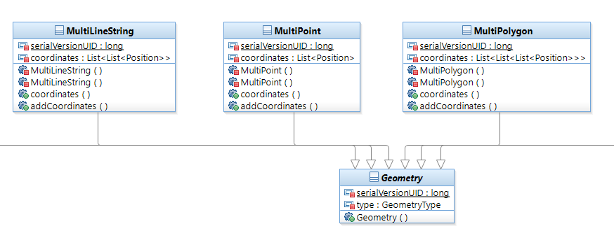

   Note the difference between this visualization and the one you created from the Java code previously. While the former was a visualization of the Java code, this one shows model elements that you can work with just like any other model.

3. Select the "Point" class and click the **Documentation** tab in the **Properties view**. Edit the documentation for the class:

   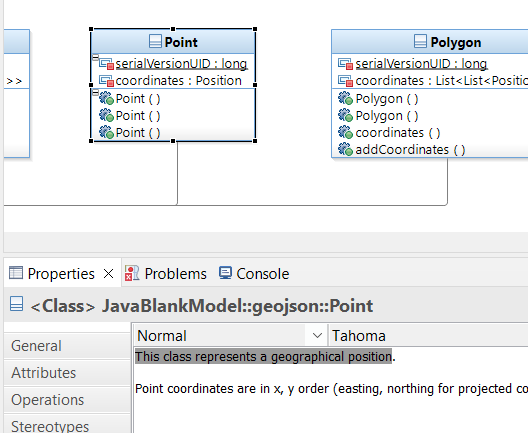

4. Also add an operation "getAltitude()" to the "Point" class. You can for example do it from the tooltip in the class diagram:

   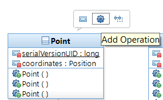

5. On the **General** tab in the **Properties** of the new operation set the return type to "Double" by clicking the **Set return type** button. Note that there are several types with the name "Double" so make sure to select the one in "java.lang". For it to appear you need to mark both checkboxes **Entire workspace** and **Referenced libraries**.

   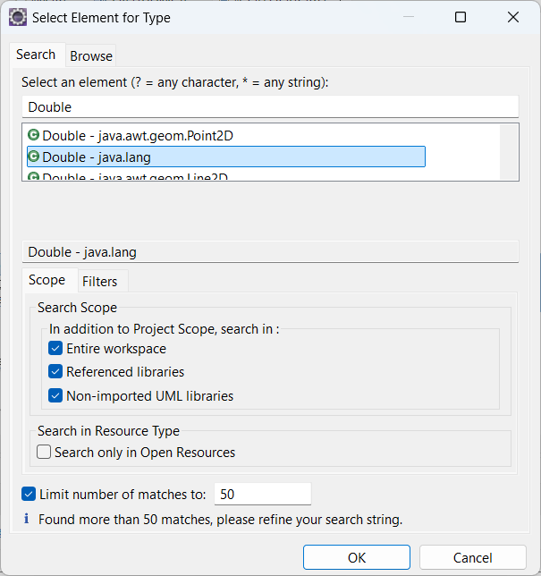

Note that you don't provide the Java code that implements the "getAltitude()" operation in the model. Instead you will do it in the next step where we will generate new Java code from the model.

### Generate Java Code from the Model

1. Create a new Java project (**File - Project** and select **Java Project**). Give it the name "RefactoredJava" and click **Finish**. Answer **No** when you are asked if you want to switch to the Java perspective.

2. Right-click on the "GeoJsonModel" project and perform the context menu command **Transform - New Configuration**. Give the transformation configuration a name ("UMLToJava") and set the transformation kind to "UML to Java". Click **Finish**.

   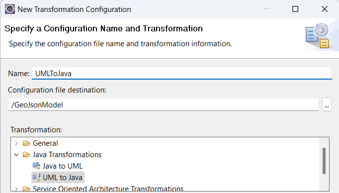

3. The transformation configuration editor opens. In the **Source and Target** tab set the source to be the "geojson" Java package and the target to be the newly created "RefactoredJava" project.

   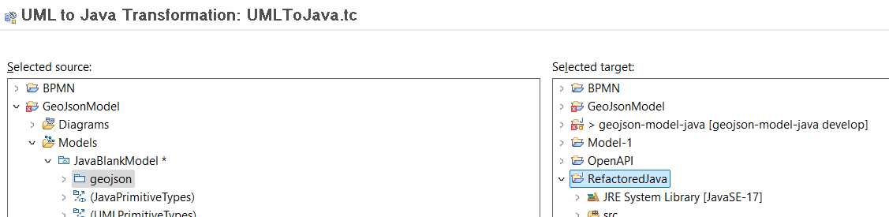

4. Save the transformation configuration and then run the transformation by clicking the button **Run UML to Java** in the transformation configuration editor toolbar:

   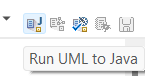

5. Expand the "RefactoredJava" project in the Project Explorer to see the generated Java code. Once again, don't worry about the build errors since we will not build the Java code in this lab.

   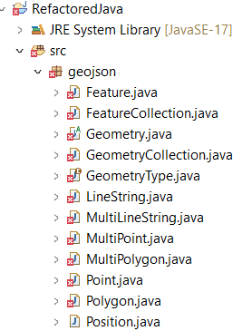

6. Double-click "Point.java" and confirm that it has the updated documentation comment in the beginning of the file. Then scroll down to the end of the file to find the "getAltitude()" method that you created. Replace the default implementation with a proper implementation for this method:

   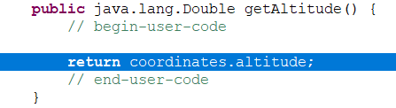

7. Re-run the "JavaToUML" transformation again and confirm that your edits remain in the file.

## Conclusion of Lab 4

This lab has introduced you to the Java support in DMA. You can directly visualize Java code in diagrams without having to first create a model. This can be useful as a way to understand and navigate around in a big code base. However, you can also choose to transform the Java code to a UML model. This can for example be useful if you want to refactor the Java code and prefer to do this using a UML model. You can then generate new Java code from that UML model. Implementations of Java methods can be written in the generated Java files, as long as you place your code within the "begin-user-code" and "end-user-code" comments.
